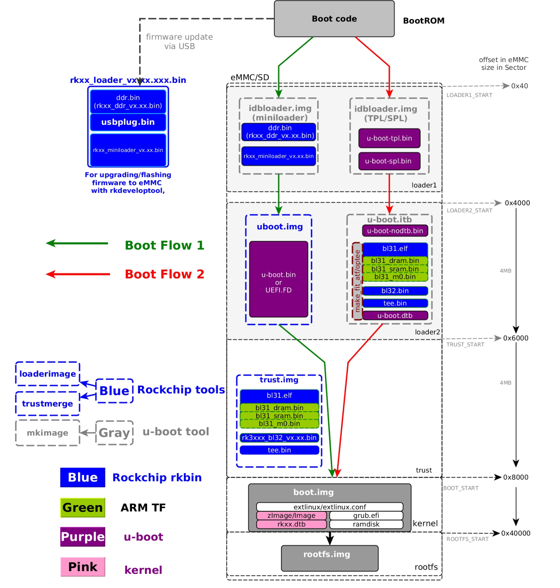
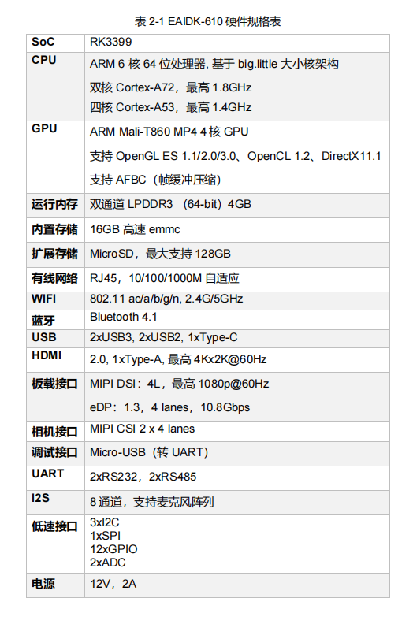
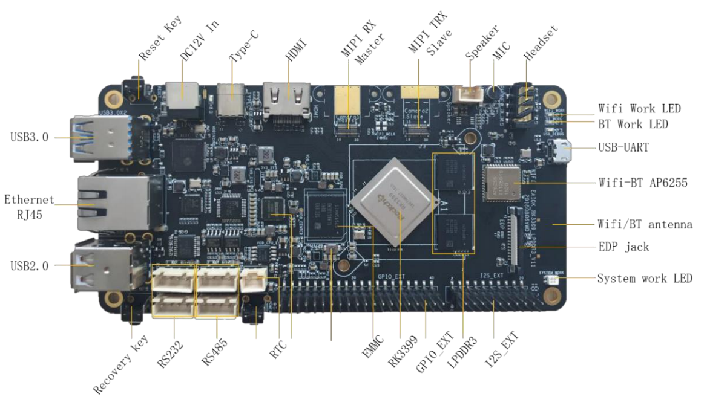
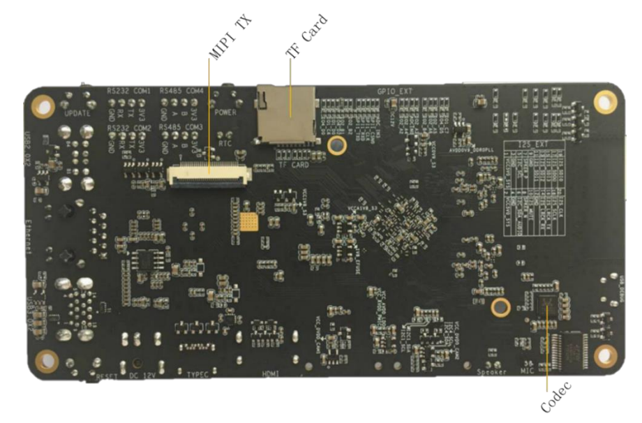

# eaidk-610(rk3399) 开发板玩耍记录

EAID（Embedded AI Development Kit）嵌入式人工智能开发套件

```
Something I hope you know before go into the coding~
First, please watch or star this repo, I'll be more happy if you follow me.
Bug report, questions and discussion are welcome, you can post an issue or pull a request.
```

## 相关站点

* 仓库地址：<https://github.com/yifengyou/eaidk-610>

## 目录

* [eaidk-610开发板介绍](docs/eaidk-610开发板介绍.md)
    * [启动过程](docs/eaidk-610开发板介绍/启动过程.md)
    * [LCD](docs/eaidk-610开发板介绍/LCD.md)
* [官方eaidk610源代码分析](docs/官方eaidk610源代码分析.md)
    * [uboot](docs/官方eaidk610源代码分析/uboot.md)
        * [打开DEBUG调试模式](docs/官方eaidk610源代码分析/uboot/打开DEBUG调试模式.md)
        * [加载启动参数](docs/官方eaidk610源代码分析/uboot/加载启动参数.md)
        * [如何显示bmp](docs/官方eaidk610源代码分析/uboot/如何显示bmp.md)
        * [增加lcd命令](docs/官方eaidk610源代码分析/uboot/增加lcd命令.md)
        * [加载resource.img及fdt](docs/官方eaidk610源代码分析/uboot/加载resource.img及fdt.md)
    * [kernel](docs/官方eaidk610源代码分析/kernel.md)
* [适配armbian](docs/适配armbian.md)
    * [uboot适配](docs/适配armbian/uboot适配.md)
    * [mipi屏幕](docs/适配armbian/mipi屏幕.md)
* [相关资源获取](docs/相关资源获取.md)
* [其他](docs/其他.md)
    * [启动日志](docs/其他/启动日志.md)


## 图示



* from : <https://github.com/lanseyujie/tn3399_v3>








---
