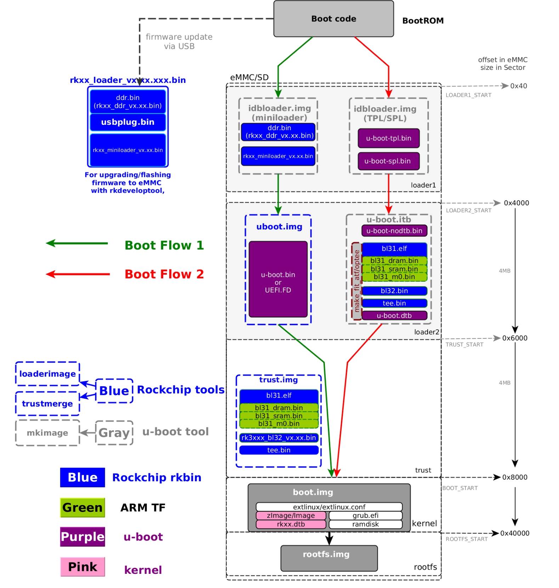
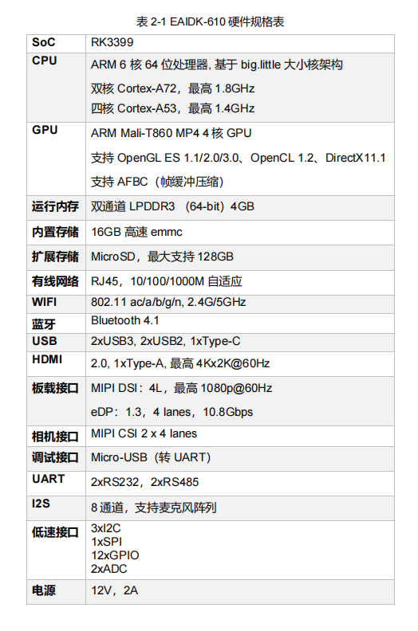
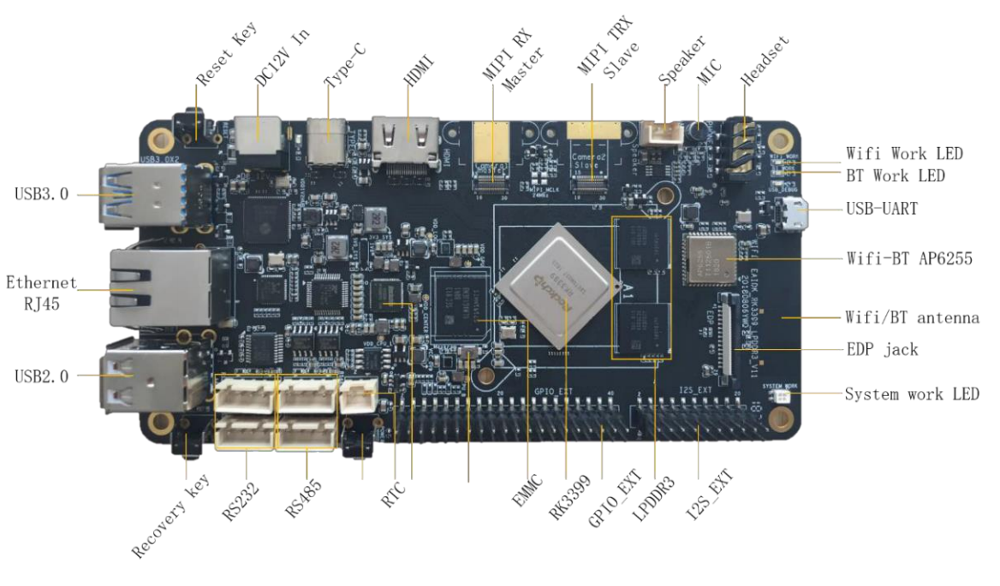
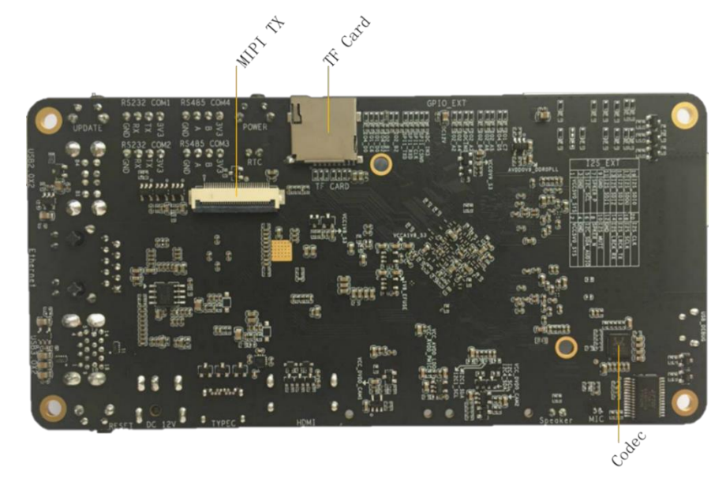

# eaidk-610(rk3399) 开发板玩耍记录

EAID（Embedded AI Development Kit）嵌入式人工智能开发套件

```
Something I hope you know before go into the coding~
First, please watch or star this repo, I'll be more happy if you follow me.
Bug report, questions and discussion are welcome, you can post an issue or pull a request.
```

## 相关站点

* [EAIDK610 网盘资料分享](https://pan.baidu.com/s/5kfXUfjcR2UNaXY2xbO6u1A?)
* [官方内核镜像仓](https://github.com/yifengyou/eaidk-610/releases/tag/official_4.4.126_image)
* [rockchip-linux仓库develop-6.6内核镜像仓](https://github.com/yifengyou/eaidk-610/releases/tag/rockchip-linux_develop-6.6_image)

## 目录

* [eaidk-610开发板介绍](docs/eaidk-610开发板介绍.md)
    * [启动过程](docs/eaidk-610开发板介绍/启动过程.md)
    * [LCD](docs/eaidk-610开发板介绍/LCD.md)
* [官方eaidk610源代码分析](docs/官方eaidk610源代码分析.md)
    * [uboot](docs/官方eaidk610源代码分析/uboot.md)
        * [打开DEBUG调试模式](docs/官方eaidk610源代码分析/uboot/打开DEBUG调试模式.md)
        * [加载启动参数](docs/官方eaidk610源代码分析/uboot/加载启动参数.md)
        * [如何显示bmp](docs/官方eaidk610源代码分析/uboot/如何显示bmp.md)
        * [增加lcd命令](docs/官方eaidk610源代码分析/uboot/增加lcd命令.md)
        * [加载resource.img及fdt](docs/官方eaidk610源代码分析/uboot/加载resource.img及fdt.md)
    * [kernel](docs/官方eaidk610源代码分析/kernel.md)
* [适配armbian](docs/适配armbian.md)
    * [uboot适配](docs/适配armbian/uboot适配.md)
    * [mipi屏幕](docs/适配armbian/mipi屏幕.md)
* [相关资源获取](docs/相关资源获取.md)
* [其他](docs/其他.md)
    * [启动日志](docs/其他/启动日志.md)


## 图示



* from : <https://github.com/lanseyujie/tn3399_v3>








## 免责声明

* 与官方无任何关联
* 仅学习交流，无任何商业用途


## uboot命令行引导系统

```shell

ext4load mmc 0:3 0x02000000 Image

ext4load mmc 0:3 0x01f00000 /rk3399-eaidk-linux.dtb

setenv bootargs 'root=PARTUUID=614e0000-0000-4b53-8000-1d28000054a9 rootwait rw console=ttyS2,1500000 cgroup_enable=cpuset cgroup_memory=1 cgroup_enable=memory net.ifnames=0 biosdevname=0 level=10 loglevel=10 selinux=0 crashkernel=384M-:128M systemd.mask=systemd-growfs@-.service rockchip.dmc_freq=528000 video=HDMI-A-1:1920x1080@60'

booti 0x02000000 - 0x01f00000

```


```shell
ext2ls mmc 0:3 /

ext4load mmc 0:3 0x02000000 vmlinuz-6.6-kdev

ext4load mmc 0:3 0x01f00000 /dtb/rk3399-eaidk-610.dtb

setenv bootargs 'root=PARTUUID=614e0000-0000-4b53-8000-1d28000054a9 rootwait rw console=ttyS2,1500000 cgroup_enable=cpuset cgroup_memory=1 cgroup_enable=memory net.ifnames=0 biosdevname=0 level=10 loglevel=10 selinux=0 crashkernel=384M-:128M systemd.mask=systemd-growfs@-.service rockchip.dmc_freq=528000 video=HDMI-A-1:1920x1080@60'

booti 0x02000000 - 0x01f00000
```

* 关闭终端输出大量内核日志

```shell

echo 0 > /proc/sys/kernel/printk
systemctl daemon-reload
mount /dev/mmcblk1p3 /boot/

```


---
