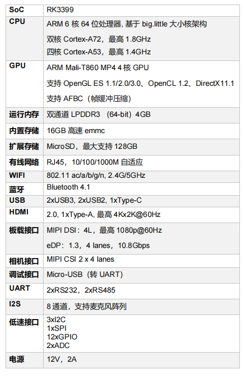
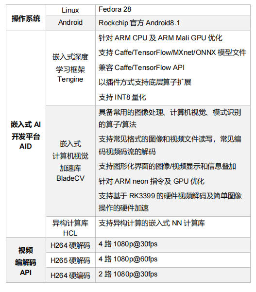
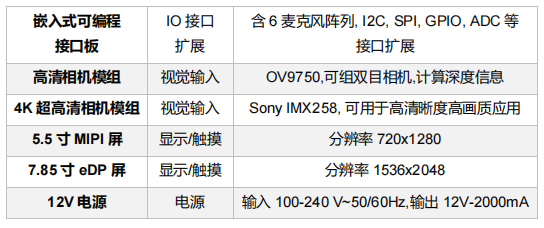
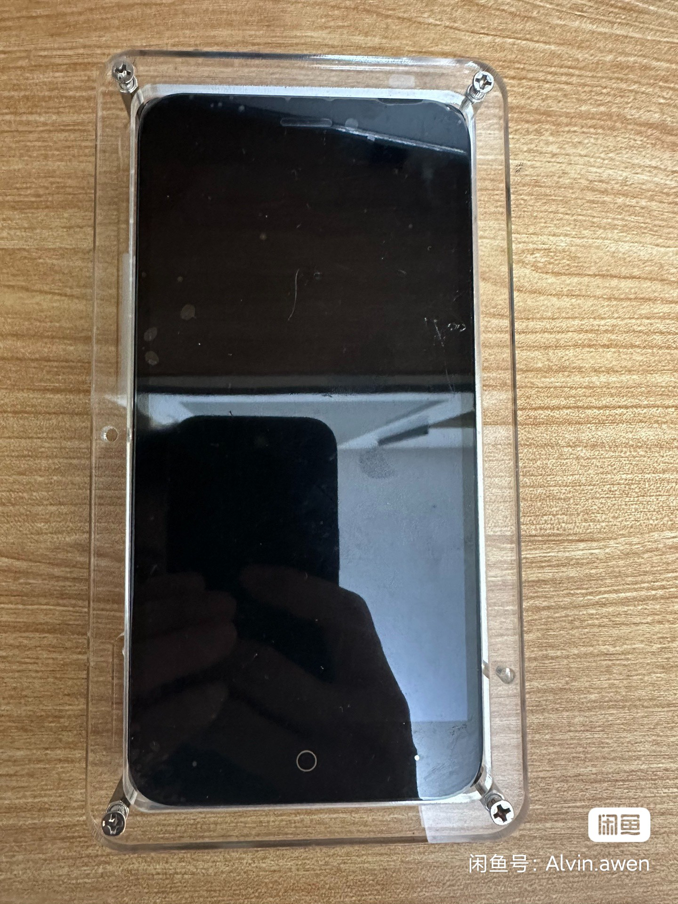
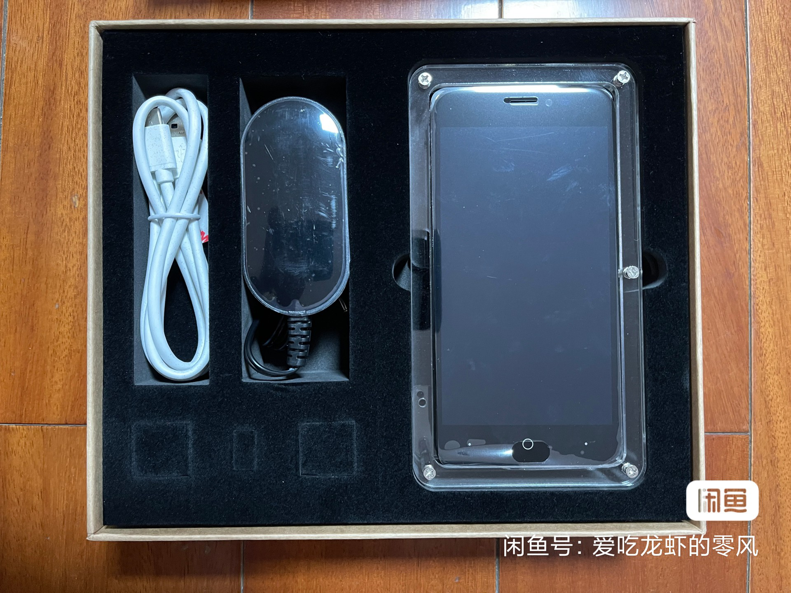
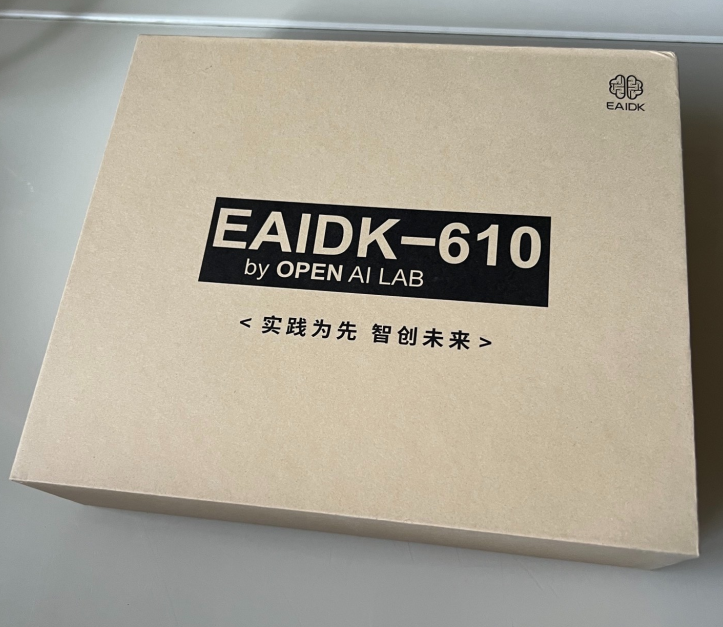
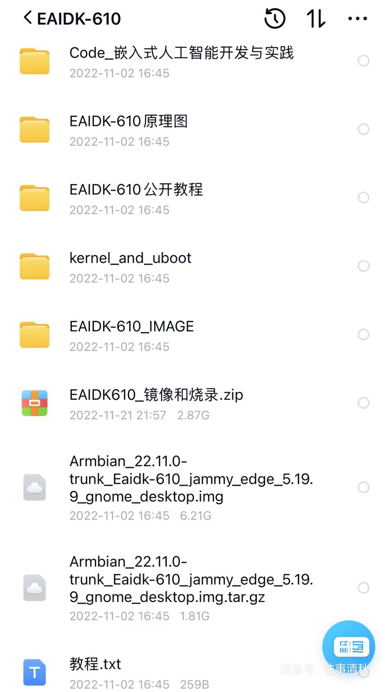
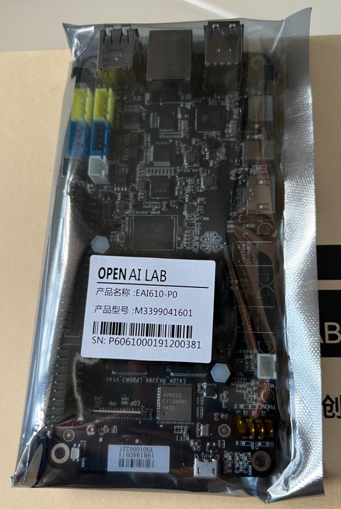
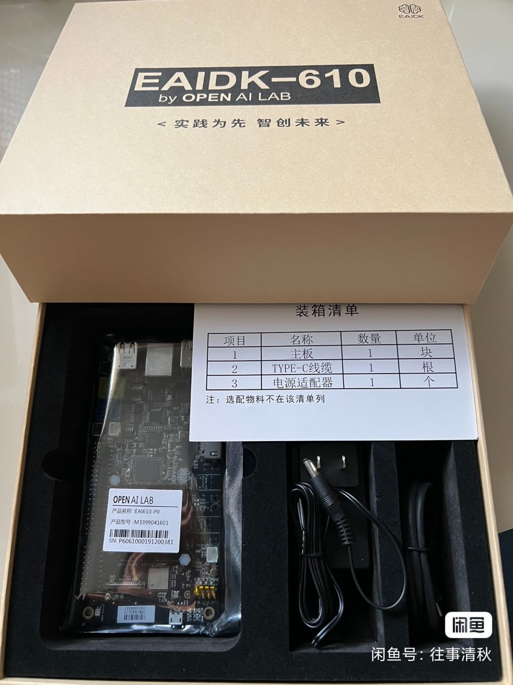
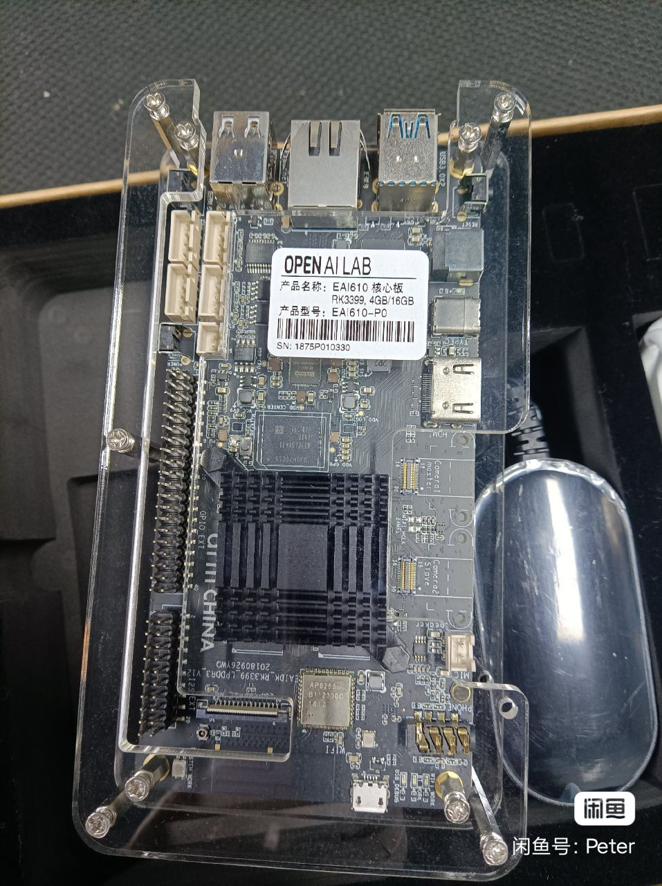

# eaidk-610开发板介绍

## 概述

EAIDK（Embedded AI Development Kit），是以 Arm SoC 为硬件平台、Tengine（Arm 中
国周易平台）为核心的人工智能基础软件平台 AID、集成典型应用算法，所形成的 “软硬一体化”
的 AI 开发套件；是专为 AI 开发者精心打造，面向边缘计算的人工智能开发套件。
硬件平台具备语音、视觉等传感器数据采集能力，及适用于多场景的运动控制接口。
软件平台支持视觉处理与分析、语音识别、语义分析、SLAM 等应用和主流开源算法，满足
AI 教育、算法应用开发、产品原型开发验证等需求。

EAIDK-610 是 EAIDK 中第一款套件，主芯片采用具备高性能 Arm SoC 的 RK3399，同时搭
载 OPEN AI LAB 嵌入式 AI 开发平台 AID（包含支持异构计算库 HCL、嵌入式深度学习框架
Tengine、以及轻量级嵌入式计算机视觉加速库 BladeCV）。为 AI 应用提供简洁、高效、统一
的 API 接口，加速终端 AI 产品的场景化应用落地。

## 术语

- EAIDK：Embedded AI Development Kit。嵌入式人工智能开发套件。
- AID：AID 是 OPEN AI LAB 开发的一个面向嵌入式平台前端智能，跨 SoC 的 AI 核心软
件平台。
- BladeCV：BladeCV 是 OPEN AI LAB 开发的，在嵌入式平台上替代 OpenCV 的计算机
视觉开发包，包含计算机视觉算法、图像获取和图形界面三部分。
- MIPI：Mobile Industry Processor Interface，移动产业处理器接口。
- eDP：Embedded DisplayPort，嵌入式数码音视讯传输接口
- CTIA: Cellular Telecommunications and Internet Association. 美国无线通信和互联网协
会。该协会制定的 AHJ（American Headset Jack）定义了二合一音频插孔的标准。

## 图示

---
