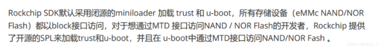

# 启动过程

1、板卡上电，cpu从片内0xffff0000(bootrom)启动，将外部存储(spi flash, emmc, sd/tf等)中读取的MiniLoaderAll.bin复制到内部SRAM中，完成对关键部分进行初始化， 如时钟，中断， 外部内存，usb设备等的初始化.(u-boot代码也可能做同样的事情)

2、MiniLoaderAll从外部存储(spi flash, emmc, sd/tf等)中读取parameter.txt,并进行解析，解析出来各个分区信息；

3、根据分区信息在外部存储的指定位置寻找trust.img镜像，并执行trust zone相关安全认证代码， 认证完毕就加载u-boot.img到指定的地址(0x00200000)运行

4, u-boot在内存中执行， 并解析bootcmd代码，启动内核

MiniLoaderAll.bin就是RK自己开发的spl

* <https://blog.csdn.net/b7376811/article/details/108316066>
* <https://blog.csdn.net/ldswfun/article/details/121336681>

* boot.img 是带有rockchip header 的ramdisk，
* kernel 是带有rockchip header 的zImage/Image，
* resource 是dtb 和带有rockchip header 的boot logo

......
├── boot.img (Android rootfs)
├── kernel.img (Kernel image with Rockchip checksum)
├── MiniLoaderAll.bin (first stage bootloader)
├── misc.img (boot command, boot recovery, wipe data etc)
├── parameter.txt
├── recovery.img
├── resource.img (kernel dtb with other boot resource files such as logo image)
├── system.img
├── trust.img
└── uboot.img

from uboot
MiniLoaderAll.bin
trust.img
uboot.img

from kernel
parameter.txt
resource.img
kernel.img
rootfs.img

---

---
