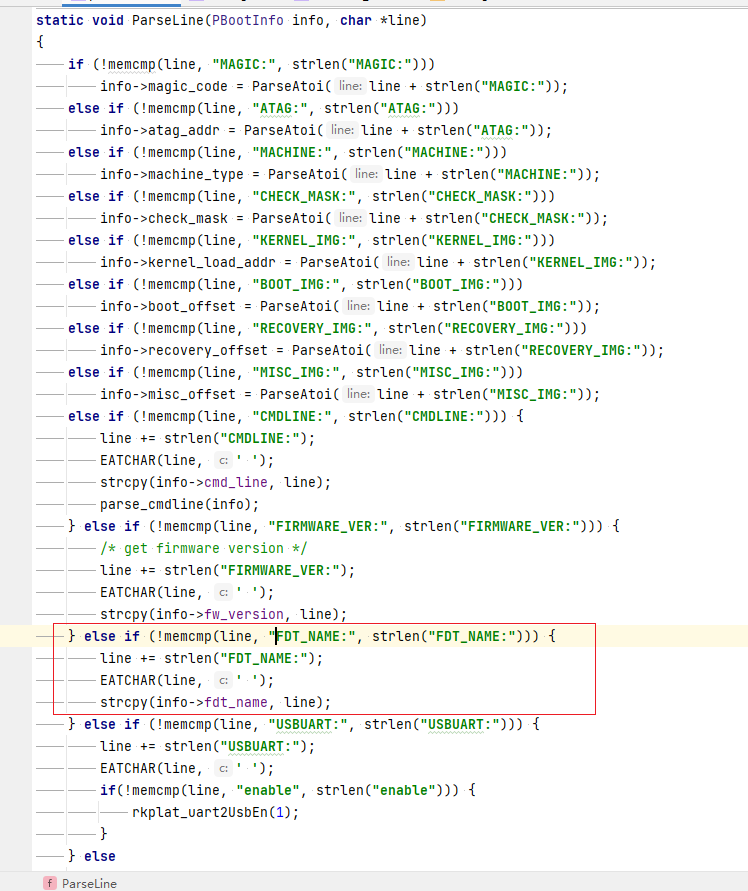

# 加载resource.img


开启调试模式，uboot启动过程中会输出fdt加载日志


定位第一条fdt记录

```
+DEBUG: rk crc32 check: crc_check = 0x539ec46a, crc_calc = 0x539ec46a
+DEBUG: check parameter success
+DEBUG: Unknow param: MACHINE_MODEL:RK3399!
+DEBUG: Unknow param: MACHINE_ID:007!
+DEBUG: Unknow param: MANUFACTURER: RK3399!
+DEBUG: Unknow param: PWR_HLD: 0,0,A,0,1!
+DEBUG: partition(uboot): offset=0x00002000, size=0x00002000
+DEBUG: partition(trust): offset=0x00004000, size=0x00002000
+DEBUG: partition(resource): offset=0x00006000, size=0x0000A000
+DEBUG: partition(kernel): offset=0x00010000, size=0x00010000
+DEBUG: rkimage_prepare_fdt
+DEBUG: Failed to find part: 'boot'
+DEBUG: Failed to prepare fdt from boot!
+DEBUG: get_content: base_offset = 0x6000
+DEBUG: get_entry: base_offset = 0x6000
+DEBUG: load_content: load_addr = 0x00000000046b5c00
Load FDT from resource image.
+DEBUG: key_init
+DEBUG: fdtdec_decode_gpio: gpios
+DEBUG: fdtdec_decode_gpios: gpios
+DEBUG: fdtdec_get_addr_size_auto_noparent: +DEBUG: fdtdec_get_addr_size_auto_parent: +DEBUG: na=2, ns=2, +DEBUG: fdtdec_get_addr_size_fixed: reg: +DEBUG: addr=ff720000
+DEBUG: gpio address = 0xff720000

```

加载启动参数，定位分区信息。在boot_later_init之后，如果要加载fdt，就得去找resource.img，或者boot，以eaidk610为例，官方给的镜像是去resource.img加载fdt

```
#ifdef CONFIG_BOARD_LATE_INIT
extern char bootloader_ver[24];
int board_late_init(void)
{
	debug("board_late_init\n");

	board_init_adjust_env();

	load_disk_partitions();

#ifdef CONFIG_RK_PWM_REMOTE
        RemotectlInit();
#endif
	debug("rkimage_prepare_fdt\n");
	rkimage_prepare_fdt();

#ifdef CONFIG_RK_KEY
	debug("key_init\n");
	key_init();
#endif
```


```
void rkimage_prepare_fdt(void)
{
	gd->fdt_blob = NULL;
	gd->fdt_size = 0;
#ifdef CONFIG_RESOURCE_PARTITION
	resource_content content = rkimage_load_fdt(get_disk_partition(BOOT_NAME));
	if (!content.load_addr) {
		debug("Failed to prepare fdt from boot! Try next.\n");
	} else {
		printf("Load FDT from boot image.\n");

		gd->fdt_blob = content.load_addr;
		gd->fdt_size = content.content_size;
		return;
	}
#ifdef CONFIG_OF_FROM_RESOURCE
	content = rkimage_load_fdt(get_disk_partition(RESOURCE_NAME));
	if (!content.load_addr) {
		debug("Failed to prepare fdt from resource! Try next.\n");
	} else {
		gd->fdt_blob = content.load_addr;
		gd->fdt_size = content.content_size;
		printf("Load FDT from resource image. addr:%x size:%d\n", gd->fdt_blob, gd->fdt_size);
		return;
	}
#endif
	content = rkimage_load_fdt(get_disk_partition(RECOVERY_NAME));
	if (!content.load_addr) {
		debug("Failed to prepare fdt from recovery! No more try, no fdt could be load.\n");
	} else {
		printf("Load FDT from recovery image.\n");

		gd->fdt_blob = content.load_addr;
		gd->fdt_size = content.content_size;
		return;
	}
#endif
}
```


根据优先级，顺序如下，如果这几个分区都没有则不进行fdt加载
1. get_disk_partition(BOOT_NAME)
2. get_disk_partition(RESOURCE_NAME)
3. get_disk_partition(RECOVERY_NAME)

```
#define BOOT_NAME       "boot"
#define RECOVERY_NAME   "recovery"
#define SYSTEM_NAME     "system"
#define BACKUP_NAME     "backup"
#define RESOURCE_NAME   "resource"
```


```
const disk_partition_t* get_disk_partition(const char *name)
{
	int part_index = find_mtd_part(&gBootInfo.cmd_mtd, name);
	if (part_index < 0) {
		debug("Failed to find part: '%s'\n", name);
		return NULL;
	}
	return &gBootInfo.cmd_mtd.parts[part_index];
}
```


```
resource_content rkimage_load_fdt(const disk_partition_t* ptn)
{
	resource_content content;
	snprintf(content.path, sizeof(content.path), "%s", get_fdt_name());
	content.load_addr = 0;

#ifndef CONFIG_RESOURCE_PARTITION
	return content;
#else
	if (!ptn)
		return content;

	if (!strcmp((char*)ptn->name, BOOT_NAME)
			|| !strcmp((char*)ptn->name, RECOVERY_NAME)) {
		//load from bootimg's second data area.
		unsigned long blksz = ptn->blksz;
		int offset = 0;
		rk_boot_img_hdr *hdr = NULL;
#ifdef CONFIG_RK_NVME_BOOT_EN
		hdr = memalign(SZ_4K, blksz << 2);
#else
		hdr = memalign(ARCH_DMA_MINALIGN, blksz << 2);
#endif
		if (StorageReadLba(ptn->start, (void *) hdr, 1 << 2) != 0) {
			return content;
		}
		if (!memcmp(hdr->magic, BOOT_MAGIC,
					BOOT_MAGIC_SIZE) && hdr->second_size) {
			//compute second data area's offset.
			offset = ptn->start + (hdr->page_size / blksz);
			offset += ALIGN(hdr->kernel_size, hdr->page_size) / blksz;
			offset += ALIGN(hdr->ramdisk_size, hdr->page_size) / blksz;

			if (get_content(offset, &content))
				load_content(&content);
		}
		return content;
	}
	//load from spec partition.
	if (get_content(ptn->start, &content))
		load_content(&content);
	return content;
#endif
}

```

它的作用是从指定的分区中加载设备树文件（fdt），并返回一个 resource_content 结构体，其中包含了设备树文件的路径和加载地址。设备树文件是一种用于描述硬件设备的数据结构，它可以让内核和驱动程序适应不同的平台和设备。

这个函数的参数是一个指向 disk_partition_t 结构体的指针，它表示要加载设备树文件的分区信息，包括分区的名称，起始扇区，扇区大小等。如果这个参数为空，那么函数会直接返回一个空的 resource_content 结构体。

这个函数的内部逻辑如下：

首先，它定义了一个 resource_content 结构体变量 content ，并初始化了它的 path 和 load_addr 字段。path 字段表示设备树文件的路径，它使用 get_fdt_name 函数来获取当前平台的设备树文件名。load_addr 字段表示设备树文件的加载地址，它初始化为 0 。
然后，它判断是否定义了 CONFIG_RESOURCE_PARTITION 宏，这个宏表示是否使用 RESOURCE 分区来存储资源文件，如 logo, fdt, parameter 等。如果没有定义这个宏，那么函数会直接返回 content 结构体，并不进行任何加载操作。

接下来，它判断传入的分区名称是否是 BOOT_NAME 或者 RECOVERY_NAME ，这两个宏表示启动分区和恢复分区的名称。如果是这两个分区之一，那么函数会尝试从 bootimg 的第二数据区域中加载设备树文件。bootimg 是一种用于存储内核和 ramdisk 的镜像格式，它由一个头部和三个数据区域组成，分别是 kernel, ramdisk 和 second 。second 数据区域可以用于存储额外的数据，如设备树文件。
为了从 bootimg 的第二数据区域中加载设备树文件，函数首先需要读取 bootimg 的头部信息，并判断是否符合 bootimg 的魔数和是否存在 second 数据区域。如果不符合条件，那么函数会直接返回 content 结构体，并不进行任何加载操作。

如果符合条件，那么函数会计算出 second 数据区域在分区中的偏移量，并调用 get_content 函数来获取该数据区域对应的 resource_content 结构体。然后调用 load_content 函数来将该数据区域加载到内存中，并返回该结构体。

最后，如果传入的分区名称不是 BOOT_NAME 或者 RECOVERY_NAME ，那么函数会尝试从指定分区中加载设备树文件。为了实现这一功能，函数会调用 get_content 函数来获取分区起始扇区对应的 resource_content 结构体。然后调用 load_content 函数来将该扇区加载到内存中，并返回该结构体。

```
#define FDT_PATH        "rk-kernel.dtb"
static const char* get_fdt_name(void)
{
	if (!gBootInfo.fdt_name[0]) {
		return FDT_PATH;
	}
	return gBootInfo.fdt_name;
}
```


resource.img解压后确实有它。这里直接定义，真粗暴



当然也可以从参数里面获取

```
FIRMWARE_VER:8.1
MACHINE_MODEL:RK3399
MACHINE_ID:007
MANUFACTURER: RK3399
MAGIC: 0x5041524B
ATAG: 0x00200800
MACHINE: 3399
CHECK_MASK: 0x80
PWR_HLD: 0,0,A,0,1
CMDLINE: androidboot.baseband=N/A androidboot.selinux=permissive androidboot.veritymode=/dev/block/platform/ff0f0000.dwmmc/by-name/metadata androidboot.hardware=rk30board androidboot.console=ttyFIQ0 root=/dev/mmcblk1p5 rw rootfstype=ext4 mtdparts=rk29xxnand:0x00002000@0x00002000(uboot),0x00002000@0x00004000(trust),0x0000a000@0x00006000(resource),0x00010000@0x00010000(kernel)
FDT_NAME: rk-kernel.dtb
```


这两个问题解决，然后就是。具体文件的加载过程

```
int StorageReadLba(uint32 LBA, void *pbuf, uint32 nSec)
{
	int ret = FTL_ERROR;

	if(gpMemFun->ReadLba)
	{
		ret = gpMemFun->ReadLba(gpMemFun->id, LBA, pbuf, nSec);
	}

	return ret;
}
```

```
bool get_content(int base_offset, resource_content* content) {
	bool ret = false;
	index_tbl_entry entry;

	debug("get_content: base_offset = 0x%x\n", base_offset);
	if (!base_offset) {
		base_offset = get_base_offset();
	}
	if (!base_offset) {
		FBTERR("base offset is NULL!\n");
		goto end;
	}
	if (!get_entry(base_offset, content->path, &entry))
		goto end;
	content->content_offset = entry.content_offset + base_offset;
	content->content_size = entry.content_size;
	ret = true;
end:
	return ret;
}
```

```
bool load_content(resource_content* content) {
	if (content->load_addr || !content->content_offset)
		return true;

	int blocks = (content->content_size + BLOCK_SIZE - 1) / BLOCK_SIZE;
#ifdef CONFIG_RK_NVME_BOOT_EN
	content->load_addr = (void*)memalign(SZ_4K, blocks * BLOCK_SIZE);
#else
	content->load_addr = (void*)memalign(ARCH_DMA_MINALIGN, blocks * BLOCK_SIZE);
#endif
	if (!content->load_addr)
		return false;

	debug("load_content: load_addr = 0x%p\n", content->load_addr);
	if (!load_content_data(content, 0,
				content->load_addr, blocks)) {
		free_content(content);
		return false;
	}
	return true;
}
```

```
bool load_content_data(resource_content* content,
		int offset_block, void* data, int blocks) {
	if (!content->content_offset)
		return false;

	if (!read_storage(content->content_offset + offset_block, data, blocks)) {
		return false;
	}
	return true;
}
```


```
static bool inline read_storage(lbaint_t offset, void* buf, uint16_t blocks) {
#if 1
	return !StorageReadLba(offset, buf, blocks);
#else
	//we may use block_read in the future.
	block_dev_desc_t* blkdev = get_dev_by_name("mmc0");
	int read = blkdev->block_read(blkdev->dev, offset,
			blocks, buf);
	return read == blocks;
#endif
}
```


bootimg 是一种用于存储 Android 系统的内核，ramdisk 和一些元数据的二进制磁盘镜像，它由引导加载程序来处理。

bootimg 的数据有以下的规则：

1. bootimg 的数据由一个头部和四个数据区域组成，分别是 kernel, ramdisk, second 和 dtb 。头部包含了一些关于这些数据区域的信息，如大小，地址，魔数等。数据区域分别存储了内核镜像，ramdisk 镜像，第二阶段引导加载程序和设备树文件。
2. bootimg 的数据按照一个固定的页大小来对齐，通常是 2048 字节或者 4096 字节。每个数据区域的大小必须是页大小的整数倍，如果不足则用 0 填充。页大小由头部中的 page_size 字段来指定。
3. bootimg 的数据按照以下的顺序排列：头部（1 页），内核（l 页），ramdisk（m 页），second（n 页），dtb（o 页）。其中 l, m, n, o 分别等于各自数据区域的大小除以页大小再向上取整。例如，如果内核大小为 5000 字节，页大小为 2048 字节，那么 l = (5000 + 2048 - 1) / 2048 = 3 。
4. bootimg 的数据可以使用 mkbootimg 工具来生成或者解析。mkbootimg 工具可以接受一些参数来指定各个数据区域的路径和地址等信息。例如：

```
mkbootimg --kernel kernel.img --ramdisk ramdisk.img --second second.img --dtb dtb.img --base 0x10000000 --pagesize 4096 -o boot.img
```

这个命令会将 kernel.img, ramdisk.img, second.img, dtb.img 这四个文件打包成一个 boot.img 文件，并指定基地址为 0x10000000 ，页大小为 4096 字节。


bootimg 是一种用于存储 Android 系统的内核，ramdisk 和一些元数据的二进制磁盘镜像，它由引导加载程序来处理。bootimg 的结构如下：

bootimg 的数据由一个头部和四个数据区域组成，分别是 kernel, ramdisk, second 和 dtb 。头部包含了一些关于这些数据区域的信息，如大小，地址，魔数等。数据区域分别存储了内核镜像，ramdisk 镜像，第二阶段引导加载程序和设备树文件。

bootimg 的数据按照一个固定的页大小来对齐，通常是 2048 字节或者 4096 字节。每个数据区域的大小必须是页大小的整数倍，如果不足则用 0 填充。页大小由头部中的 page_size 字段来指定。

bootimg 的数据按照以下的顺序排列：头部（1 页），内核（l 页），ramdisk（m 页），second（n 页），dtb（o 页）。其中 l, m, n, o 分别等于各自数据区域的大小除以页大小再向上取整。例如，如果内核大小为 5000 字节，页大小为 2048 字节，那么 l = (5000 + 2048 - 1) / 2048 = 3 。
bootimg 的头部结构定义如下：

```
struct boot_img_hdr {
    unsigned char magic[BOOT_MAGIC_SIZE]; // 魔数，固定为 "ANDROID!"
    unsigned kernel_size; // 内核大小，单位为字节
    unsigned kernel_addr; // 内核加载地址
    unsigned ramdisk_size; // ramdisk 大小，单位为字节
    unsigned ramdisk_addr; // ramdisk 加载地址
    unsigned second_size; // second 大小，单位为字节
    unsigned second_addr; // second 加载地址
    unsigned tags_addr; // 设备树标签地址
    unsigned page_size; // 页大小，单位为字节
    unsigned unused[2]; // 未使用的字段，保留为 0
    unsigned char name[BOOT_NAME_SIZE]; // 设备名称
    unsigned char cmdline[BOOT_ARGS_SIZE]; // 启动参数
    unsigned id[8]; // 校验和或者其他标识信息
};
```

讲道理，bootimg多简单，根本没有文件系统。而是将文件按照上述结构体定义平铺开来。


---
