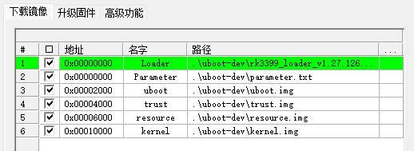

# 加载启动参数

```
+DEBUG: board_late_init
+DEBUG: getenv: bootdelay = 153
+DEBUG: Initial value for argc=3
+DEBUG: Final value for argc=3
+DEBUG: setenv: bootdelay = 99
+DEBUG: getenv: bootcmd = bootrk
+DEBUG: getenv: initrd_high = 0xffffffffffffffff=n
+DEBUG: board init saveenv.
+DEBUG: EXPORT  table = 00000000049653d8, htab.size = 79, htab.filled = 6, size = 508
Unsorted: n=6
	  0: 00000000046b4d00 ==> bootcmd    => bootrk
	  1: 00000000046b4d28 ==> initrd_high => 0xffffffffffffffff=n
	  2: 00000000046b4da0 ==> baudrate   => 1500000
	  3: 00000000046b4f80 ==> verify     => n
	  4: 00000000046b5020 ==> bootdelay  => 99
	  5: 00000000046b51d8 ==> fastboot_unlocked => 0
Writing env to storage...
done
GetParam
+DEBUG: rk crc32 check: crc_check = 0x539ec46a, crc_calc = 0x539ec46a
+DEBUG: check parameter success
+DEBUG: Unknow param: MACHINE_MODEL:RK3399!
+DEBUG: Unknow param: MACHINE_ID:007!
+DEBUG: Unknow param: MANUFACTURER: RK3399!
+DEBUG: Unknow param: PWR_HLD: 0,0,A,0,1!
+DEBUG: partition(uboot): offset=0x00002000, size=0x00002000
+DEBUG: partition(trust): offset=0x00004000, size=0x00002000
+DEBUG: partition(resource): offset=0x00006000, size=0x0000A000
+DEBUG: partition(kernel): offset=0x00010000, size=0x00010000
```

在 board_late_init 阶段，会去解析参数

```
#ifdef CONFIG_BOARD_LATE_INIT
extern char bootloader_ver[24];
int board_late_init(void)
{
	debug("board_late_init\n");

	board_init_adjust_env();

	load_disk_partitions();

#ifdef CONFIG_RK_PWM_REMOTE
        RemotectlInit();
#endif
	debug("rkimage_prepare_fdt\n");
	rkimage_prepare_fdt();

#ifdef CONFIG_RK_KEY
	debug("key_init\n");
	key_init();
#endif

```

```
int load_disk_partitions(void)
{
	int i = 0;
	int ret = -1;
	cmdline_mtd_partition *cmd_mtd;
	PLoaderParam param;
#ifdef CONFIG_RK_NVME_BOOT_EN
	param = (PLoaderParam)memalign(SZ_4K, MAX_LOADER_PARAM * PARAMETER_NUM);
#else
	param = (PLoaderParam)memalign(ARCH_DMA_MINALIGN, MAX_LOADER_PARAM * PARAMETER_NUM);
#endif
	/* int32 GetParam(uint32 param_addr, void *buf) */
	/* 准备空间用于加载param信息 */
	if (!GetParam(0, param)) {
		/* 逐行解析参数，赋值全局变量gBootInfo */
		ParseParam(&gBootInfo, param->parameter, param->length);
		debug("[YYF] parameter(len=%d):\n\n%s\n\n", param->length, param->parameter);
		cmd_mtd = &(gBootInfo.cmd_mtd);
		for(i = 0; i < cmd_mtd->num_parts; i++) {
			if (i >= CONFIG_MAX_PARTITIONS) {
				printf("Failed! Too much partition: %d(%d)\n",
						cmd_mtd->num_parts, CONFIG_MAX_PARTITIONS);
				goto end;
			}
			debug("partition(%s): offset=0x%08lX, size=0x%08lX\n", \
					cmd_mtd->parts[i].name, cmd_mtd->parts[i].start, \
					cmd_mtd->parts[i].size);
		}
		ret = 0;
	}
end:
	if (param)
		free(param);

	return ret;
}

```

这里的条件编译很关键，关系到NVME是否支持启动

这段代码的作用是为 param 变量分配一块内存空间，用于存储 loader 参数。param 变量的类型是 PLoaderParam ，它是一个指向 LoaderParam 结构体的指针。

LoaderParam 结构体定义了一些与启动相关的参数，如 boot mode, boot dev, boot type 等。

param 变量需要分配 MAX_LOADER_PARAM * PARAMETER_NUM 大小的内存空间，其中 MAX_LOADER_PARAM 是每个参数的最大长度，PARAMETER_NUM 是参数的个数。

这段代码使用 memalign 函数来分配内存空间，memalign 函数的原型是：
```
void *memalign(size_t alignment, size_t size);
```
memalign 函数会返回一个指向 size 大小的内存空间的指针，该内存空间的地址是 alignment 的整数倍。alignment 参数必须是 2 的幂，并且是 sizeof(void *) 的整数倍。

这段代码中，alignment 参数的值取决于宏 CONFIG_RK_NVME_BOOT_EN 是否定义。

CONFIG_RK_NVME_BOOT_EN 是一个用于控制是否支持 NVME 启动的宏，NVME 是一种基于 PCI Express 接口的非易失性内存存储技术。
- 如果 CONFIG_RK_NVME_BOOT_EN 定义了，那么 alignment 参数的值为 SZ_4K ，即 4096 字节；
- 如果 CONFIG_RK_NVME_BOOT_EN 没有定义，那么 alignment 参数的值为 ARCH_DMA_MINALIGN ，即 64 字节。

这样做的原因可能是为了满足 NVME 设备的对齐要求，或者为了提高 NVME 设备的性能。根据 NVMe Specification ，NVMe 设备支持不同大小的扇区（sector），每个扇区包含一个或多个逻辑块（logical block）。NVMe 设备可以通过 Get Features 命令来获取当前扇区大小和逻辑块大小2。一般来说，NVMe 设备的扇区大小和逻辑块大小都是 2 的幂，并且至少为 512 字节3。因此，为了保证 param 变量的地址与 NVMe 设备的扇区或逻辑块对齐，alignment 参数需要设置为至少 512 字节，而 SZ_4K 是一个比较常见的对齐值。

另一方面，如果没有定义 CONFIG_RK_NVME_BOOT_EN ，那么 alignment 参数可以设置为 ARCH_DMA_MINALIGN ，即 64 字节。

ARCH_DMA_MINALIGN 是一个与 DMA 相关的宏，DMA 是一种直接内存访问技术，可以让外设在不经过 CPU 的情况下读写内存。

ARCH_DMA_MINALIGN 的值取决于不同的架构和平台，一般来说，它是为了保证 DMA 操作能够正确地访问内存而设置的最小对齐值6


```
int32 GetParam(uint32 param_addr, void *buf)
{
	PLoaderParam param = (PLoaderParam)buf;
	int read_sec = MAX_LOADER_PARAM >> 9;
	int i = 0;

	printf("GetParam\n");

	for (i = 0; i < PARAMETER_NUM; i++) {
		if (StorageReadLba(param_addr + i * PARAMETER_OFFSET, buf, read_sec) == 0) {
			if (CheckParam(param) == 0) {
				debug("check parameter success\n");
				return 0;
			} else {
				printf("Invalid parameter\n");
				return -1;
			}
		} else {
			printf("read parameter fail\n");
			return -2;
		}
	}

	return -3;
}
```

```
/* 一行最多1024Bytes */
void ParseParam(PBootInfo info, char *param, uint32 len)
{
	char *prev_param = NULL;
	char line[MAX_LINE_CHAR] = "\0";
	int32 remain_len = (int32)len;

	while(remain_len > 0) {
		/* 获取一行数据(不含回车换行符，且左边不含空格) */
		prev_param = param;
		param = getline(param, remain_len, line);
		remain_len -= (param - prev_param);

		/* 去除空行及注释行 */
		if ((line[0] != 0) && (line[0] != '#'))
			/* 解析参数 */
			ParseLine(info, line);
	}
}
```


接下来，逐行解析。最关键的是ParseLine，状态机，判断字段，赋值

```
static void ParseLine(PBootInfo info, char *line)
{
	if (!memcmp(line, "MAGIC:", strlen("MAGIC:")))
		info->magic_code = ParseAtoi(line + strlen("MAGIC:"));
	else if (!memcmp(line, "ATAG:", strlen("ATAG:")))
		info->atag_addr = ParseAtoi(line + strlen("ATAG:"));
	else if (!memcmp(line, "MACHINE:", strlen("MACHINE:")))
		info->machine_type = ParseAtoi(line + strlen("MACHINE:"));
	else if (!memcmp(line, "CHECK_MASK:", strlen("CHECK_MASK:")))
		info->check_mask = ParseAtoi(line + strlen("CHECK_MASK:"));
	else if (!memcmp(line, "KERNEL_IMG:", strlen("KERNEL_IMG:")))
		info->kernel_load_addr = ParseAtoi(line + strlen("KERNEL_IMG:"));
	else if (!memcmp(line, "BOOT_IMG:", strlen("BOOT_IMG:")))
		info->boot_offset = ParseAtoi(line + strlen("BOOT_IMG:"));
	else if (!memcmp(line, "RECOVERY_IMG:", strlen("RECOVERY_IMG:")))
		info->recovery_offset = ParseAtoi(line + strlen("RECOVERY_IMG:"));
	else if (!memcmp(line, "MISC_IMG:", strlen("MISC_IMG:")))
		info->misc_offset = ParseAtoi(line + strlen("MISC_IMG:"));
	else if (!memcmp(line, "CMDLINE:", strlen("CMDLINE:"))) {
		line += strlen("CMDLINE:");
		EATCHAR(line, ' ');
		strcpy(info->cmd_line, line);
		parse_cmdline(info);
	} else if (!memcmp(line, "FIRMWARE_VER:", strlen("FIRMWARE_VER:"))) {
		/* get firmware version */
		line += strlen("FIRMWARE_VER:");
		EATCHAR(line, ' ');
		strcpy(info->fw_version, line);
	} else if (!memcmp(line, "FDT_NAME:", strlen("FDT_NAME:"))) {
		line += strlen("FDT_NAME:");
		EATCHAR(line, ' ');
		strcpy(info->fdt_name, line);
	} else if (!memcmp(line, "USBUART:", strlen("USBUART:"))) {
		line += strlen("USBUART:");
		EATCHAR(line, ' ');
		if(!memcmp(line, "enable", strlen("enable"))) {
			rkplat_uart2UsbEn(1);
		}
	} else
		debug("Unknow param: %s!\n", line);
}
```

继续跟踪启动参数

```
static int parse_cmdline(PBootInfo info)
{
	info->cmd_mtd.num_parts = 0;
	info->cmd_mtd.mtd_id[0] = '\0';

	if(!mtdpart_parse(info->cmd_line, &info->cmd_mtd))
		return -2;

	info->index_misc = find_mtd_part(&info->cmd_mtd, PARTNAME_MISC);
	info->index_kernel = find_mtd_part(&info->cmd_mtd, PARTNAME_KERNEL);
	info->index_boot = find_mtd_part(&info->cmd_mtd, PARTNAME_BOOT);
	info->index_recovery = find_mtd_part(&info->cmd_mtd, PARTNAME_RECOVERY);
	info->index_system = find_mtd_part(&info->cmd_mtd, PARTNAME_SYSTEM);
	info->index_backup = find_mtd_part(&info->cmd_mtd, PARTNAME_BACKUP);

	get_rdInfo(info);

	if ((info->index_misc < 0) || (info->index_kernel < 0) \
		|| (info->index_boot < 0) || (info->index_recovery < 0))
		return -1;

	return 0;
}
```

就这几个分区比较特殊，misc\kernel\boot\recovery\system\backup ?

```
static int find_mtd_part(cmdline_mtd_partition *this_mtd, const char *part_name)
{
	int i = 0;
	for(i = 0; i < this_mtd->num_parts; i++)
		if(!strcmp(part_name, (const char *)this_mtd->parts[i].name))
			return i;

	return -1;
}
```

如何匹配分区，其实就是字符串匹配。也不一定非要有这些




---
