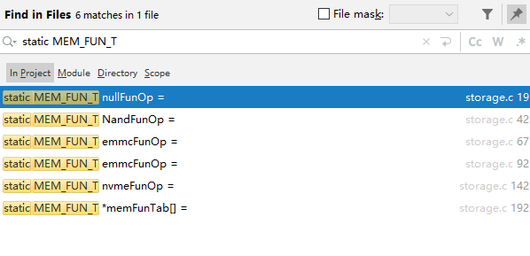
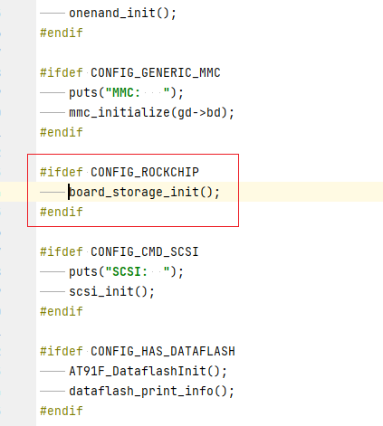

# 加载环境变量


## 位置：board_late_init

```
#ifdef CONFIG_BOARD_LATE_INIT
extern char bootloader_ver[24];
int board_late_init(void)
{
	debug("[YYF] %s:%s:%d\n", __FILE__, __func__, __LINE__);

	board_init_adjust_env();

	load_disk_partitions();

#ifdef CONFIG_RK_PWM_REMOTE
        RemotectlInit();
#endif
```

## 输出日志

```
+DEBUG: [YYF] board_late_init:179
+DEBUG: [YYF] board_init_adjust_env:123
+DEBUG: getenv: bootdelay = 153
+DEBUG: Initial value for argc=3
+DEBUG: Final value for argc=3
+DEBUG: setenv: bootdelay = 99
+DEBUG: getenv: bootcmd = bootrk
+DEBUG: getenv: initrd_high = 0xffffffffffffffff=n
+DEBUG: board init saveenv.
+DEBUG: EXPORT  table = 0000000004964770, htab.size = 79, htab.filled = 6, size = 508
Unsorted: n=6
	  0: 00000000046b3d00 ==> bootcmd    => bootrk
	  1: 00000000046b3d28 ==> initrd_high => 0xffffffffffffffff=n
	  2: 00000000046b3da0 ==> baudrate   => 1500000
	  3: 00000000046b3f80 ==> verify     => n
	  4: 00000000046b4020 ==> bootdelay  => 99
	  5: 00000000046b41d8 ==> fastboot_unlocked => 0
Writing env to storage...
done
```

## 作用

```
#define RAMDISK_ZERO_COPY_SETTING	"0xffffffffffffffff=n\0"
static void board_init_adjust_env(void)
{
	bool change = false;

	debug("[YYF] %s:%s:%d\n", __FILE__, __func__, __LINE__);

	char *s = getenv("bootdelay");
	if (s != NULL) {
		unsigned long bootdelay = 0;

		bootdelay = simple_strtoul(s, NULL, 16);
		debug("getenv: bootdelay = %lu\n", bootdelay);
#if (CONFIG_BOOTDELAY <= 0)
		if (bootdelay > 0) {
			setenv("bootdelay", simple_itoa(0));
			change = true;
			debug("setenv: bootdelay = 0\n");
		}
#else
		if (bootdelay != CONFIG_BOOTDELAY) {
			setenv("bootdelay", simple_itoa(CONFIG_BOOTDELAY));
			change = true;
			debug("setenv: bootdelay = %d\n", CONFIG_BOOTDELAY);
		}
#endif
	}

	s = getenv("bootcmd");
	if (s != NULL) {
		debug("getenv: bootcmd = %s\n", s);
		if (strcmp(s, CONFIG_BOOTCOMMAND) != 0) {
			setenv("bootcmd", CONFIG_BOOTCOMMAND);
			change = true;
			debug("setenv: bootcmd = %s\n", CONFIG_BOOTCOMMAND);
		}
	}

	s = getenv("initrd_high");
	if (s != NULL) {
		debug("getenv: initrd_high = %s\n", s);
		if (strcmp(s, RAMDISK_ZERO_COPY_SETTING) != 0) {
			setenv("initrd_high", RAMDISK_ZERO_COPY_SETTING);
			change = true;
			debug("setenv: initrd_high = %s\n", RAMDISK_ZERO_COPY_SETTING);
		}
	}

	if (change) {
#ifdef CONFIG_CMD_SAVEENV
		debug("board init saveenv.\n");
		saveenv();
#endif
	}
}

```


基本步骤，校正各环境变量，然后保存。至于校正，其实就是判断值的合理性


```
int saveenv(void)
{
	env_t *env_new = (env_t *)env_buf;
	ssize_t	len;
	char	*res;

	debug("[YYF] %s:%s:%d\n", __FILE__, __func__, __LINE__);

	res = (char *)env_new->data;
	len = hexport_r(&env_htab, '\0', 0, &res, ENV_SIZE, 0, NULL);
	if (len < 0) {
		error("Cannot export environment: errno = %d\n", errno);
		return -1;
	}

	env_new->crc = crc32_rk(0, env_new->data, ENV_SIZE);
	printf("Writing env to storage... \n");
	if (write_env(CONFIG_ENV_SIZE, CONFIG_ENV_OFFSET, (u_char *)env_new)) {
		puts("failed\n");
		return -1;
	}

	puts("done\n");
	return 0;
}
```


```
static inline int write_env(unsigned long size,
			    unsigned long offset, const void *buffer)
{
	uint blk_start, blk_cnt, i;
	blk_start   = ALIGN(offset, RK_BLK_SIZE) / RK_BLK_SIZE;
	blk_cnt     = ALIGN(size, RK_BLK_SIZE) / RK_BLK_SIZE;

	for (i = 0;i < blk_cnt;i++)
	{
		if(StorageUbootSysDataStore(blk_start + i,
				(void*)buffer + i * RK_BLK_SIZE))
		{
			printf("write_env failed at %d\n", blk_start + i);
			return -1;
		}
	}

	return 0;
}
```

```
#define UBOOT_SYS_DATA_OFFSET 64
uint32 StorageUbootSysDataLoad(uint32 Index, void *Buf)
{
	return StorageSysDataLoad(Index + UBOOT_SYS_DATA_OFFSET, Buf);
}


uint32 StorageUbootSysDataStore(uint32 Index, void *Buf)
{
	return StorageSysDataStore(Index + UBOOT_SYS_DATA_OFFSET, Buf);
}
```

```
uint32 StorageSysDataStore(uint32 Index, void *Buf)
{
	uint32 ret = FTL_ERROR;

	if(gpMemFun->SysDataStore)
	{
		ret = gpMemFun->SysDataStore(gpMemFun->id, Index, Buf);
	}

	return ret;
}

```

```
//1全局变量
#undef	EXT
#ifdef	IN_STORAGE
#define	EXT
#else
#define	EXT		extern
#endif

EXT MEM_FUN_T * gpMemFun;

typedef struct MEM_FUN_Tag
{
	uint16 id;
	uint16 flag; // 传递给kernel的，确定从哪里引导到flash的
	uint32 Valid;
	Memory_Init Init;
	Memory_ReadID ReadId;
	Memory_ReadPba ReadPba;
	Memory_WritePba WritePba;
	Memory_ReadLba ReadLba;
	Memory_WriteLba WriteLba;
	Memory_Erase Erase;
	Memory_ReadInfo ReadInfo;
	Memory_IntForUpdate IntForUpdate;
	Memory_LowFormat LowFormat;
	Memory_GetCurEraseBlock GetCurEraseBlock;
	Memory_GetTotleBlk GetTotleBlk;
	Memory_GetCapacity GetCapacity;
	Memory_SysDataLoad SysDataLoad;
	Memory_SysDataStore SysDataStore;
	Memory_erase_data erase_data;
} MEM_FUN_T, pMEM_FUN_T;
```




gpMemFun 结构体是一个全局变量，它是一个指向 MemFun_t 结构体的指针，MemFun_t 结构体定义了不同类型的存储设备的相关函数和参数。gpMemFun 结构体是在 StorageInit 函数中初始化的，StorageInit 函数是在 board_init_r 函数中调用的，board_init_r 函数是在 U-Boot 的启动过程中执行的。


```c
// board_init_r is the main function of U-Boot
void board_init_r (gd_t *id, ulong dest_addr)
{
    // some code omitted
    // call StorageInit to initialize the storage device
    StorageInit ();
    // some code omitted
}

// StorageInit is the function to initialize the storage device
int32 StorageInit (void)
{
    // some code omitted
    // call StorageGetMemFun to get the pointer to MemFun_t structure
    gpMemFun = StorageGetMemFun ();
    // some code omitted
}

// StorageGetMemFun is the function to get the pointer to MemFun_t structure
MemFun_t *StorageGetMemFun (void)
{
    // some code omitted
    // check the storage device type and return the corresponding pointer
    switch (StorageDevice)
    {
        case STORAGE_NAND:
            return &gNandOps;
        case STORAGE_EMMC:
            return &gEmmcOps;
        case STORAGE_SDCARD:
            return &gSdcardOps;
        default:
            return NULL;
    }
}
```



```
int32 StorageInit(void)
{
	uint32 memdev;

	memset((uint8*)&g_FlashInfo, 0, sizeof(g_FlashInfo));
	for(memdev=0; memdev<MAX_MEM_DEV; memdev++)
	{
		gpMemFun = memFunTab[memdev];
		if(memFunTab[memdev]->Init(memFunTab[memdev]->id) == 0)
		{
			memFunTab[memdev]->Valid = 1;
			StorageReadFlashInfo((uint8*)&g_FlashInfo);
			vendor_storage_init();
			return 0;
		}
	}

	/* if all media init error, usding null function */
	gpMemFun = &nullFunOp;

	return -1;
}
```


SysDataStore 函数是一个指向具体存储设备的函数指针，它是由 gpMemFun 结构体中的 SysDataStore 字段来赋值的。SysDataStore 函数的具体实现和功能可能因不同的存储设备而有所差异，但一般来说，它会将系统数据写入到存储设备的某个分区或者扇区中。您可以参考以下的代码来了解 SysDataStore 函数的定位过程：

```c
// SysDataStore is a function pointer to store system data to storage device
uint32 (*SysDataStore)(uint32 id, uint32 Index, void *Buf);

// gNandOps, gEmmcOps and gSdcardOps are global variables of MemFun_t structure for different storage devices
MemFun_t gNandOps = {
    .id = STORAGE_NAND,
    .SysDataLoad = NandSysDataLoad,
    .SysDataStore = NandSysDataStore,
    .SysDataErase = NandSysDataErase,
    // other fields and functions
};

MemFun_t gEmmcOps = {
    .id = STORAGE_EMMC,
    .SysDataLoad = EmmcSysDataLoad,
    .SysDataStore = EmmcSysDataStore,
    .SysDataErase = EmmcSysDataErase,
    // other fields and functions
};

MemFun_t gSdcardOps = {
    .id = STORAGE_SDCARD,
    .SysDataLoad = SdcardSysDataLoad,
    .SysDataStore = SdcardSysDataStore,
    .SysDataErase = SdcardSysDataErase,
    // other fields and functions
};

// NandSysDataStore, EmmcSysDataStore and SdcardSysDataStore are the actual functions to store system data to NAND Flash, eMMC and SD Card respectively
uint32 NandSysDataStore (uint32 id, uint32 Index, void *Buf)
{
    // some code to write data to NAND Flash partition or sector
}

uint32 EmmcSysDataStore (uint32 id, uint32 Index, void *Buf)
{
    // some code to write data to eMMC partition or sector
}

uint32 SdcardSysDataStore (uint32 id, uint32 Index, void *Buf)
{
    // some code to write data to SD Card partition or sector
}
```


```
int vendor_storage_init(void)
{
	u32 i, max_ver, max_index, vendor_part_num;
	u8 *p_buf;

	vendor_part_num = VENDOR_PART_NUM;
	#if defined(RK_FLASH_BOOT_EN)
	if (StorageGetBootMedia() == BOOT_FROM_FLASH)
		vendor_part_num = NAND_VENDOR_PART_NUM;
	#endif

	max_ver = 0;
	max_index = 0;
	for (i = 0; i < vendor_part_num; i++) {
		/* read first 512 bytes */
		p_buf = (u8 *)&g_vendor;
		if (vendor_ops(p_buf, VENDOR_PART_SIZE * i, 1, 0))
			return -1;
		/* read last 512 bytes */
		p_buf += (VENDOR_PART_SIZE - 1) * 512;
		if (vendor_ops(p_buf, VENDOR_PART_SIZE * (i + 1) - 1, 1, 0))
			return -1;

		if (g_vendor.tag == VENDOR_TAG &&
		    g_vendor.version2 == g_vendor.version) {
			if (max_ver < g_vendor.version) {
				max_index = i;
				max_ver = g_vendor.version;
			}
		}
	}
	if (max_ver) {
		if (vendor_ops((u8 *)&g_vendor, VENDOR_PART_SIZE * max_index,
				VENDOR_PART_SIZE, 0))
			return -1;
	} else {
		memset(&g_vendor, 0, sizeof(g_vendor));
		g_vendor.version = 1;
		g_vendor.tag = VENDOR_TAG;
		g_vendor.version2 = g_vendor.version;
		g_vendor.free_offset = 0;
		g_vendor.free_size = sizeof(g_vendor.data);
	}
	return 0;
}
```


---
