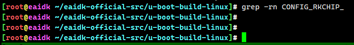

# 按键初始化

```
#ifdef CONFIG_BOARD_LATE_INIT
extern char bootloader_ver[24];
int board_late_init(void)
{
	debug("board_late_init\n");

	board_init_adjust_env();

	debug("load_disk_partitions\n");
	load_disk_partitions();

#ifdef CONFIG_RK_PWM_REMOTE
        RemotectlInit();
#endif

	debug("rkimage_prepare_fdt\n");
	rkimage_prepare_fdt();

#ifdef CONFIG_RK_KEY
	debug("key_init\n");
	key_init();
#endif
```

加载fdt后，立即开始按键初始化


```
void key_init(void)
{
	memset(&key_rockusb, 0, sizeof(key_config));
	memset(&key_recovery, 0, sizeof(key_config));
	memset(&key_fastboot, 0, sizeof(key_config));
	memset(&key_power, 0, sizeof(key_config));

	memset(&power_hold_gpio, 0, sizeof(gpio_conf));
	memset(&charge_state_gpio, 0, sizeof(gpio_conf));

	RockusbKeyInit();


#if !(defined(CONFIG_RKCHIP_RK3036) || defined(CONFIG_RKCHIP_RK322X))
	FastbootKeyInit();
	RecoveryKeyInit();
	PowerKeyInit();

	ChargeStateGpioInit();
	PowerHoldGpioInit();
#endif
}
```

全局静态变量

```
__maybe_unused static key_config	key_rockusb;
__maybe_unused static key_config	key_recovery;
__maybe_unused static key_config	key_fastboot;
__maybe_unused static key_config	key_power;
```

```
__maybe_unused static void RockusbKeyInit(void)
{
#if defined(CONFIG_RKCHIP_RK3036)

	key_rockusb.type = KEY_INT;
	key_rockusb.key.ioint.name = "rockusb_key";

	#if defined(CONFIG_PRODUCT_ECHO)
		key_rockusb.key.ioint.gpio = (GPIO_BANK2 | GPIO_C7);
	#else
		key_rockusb.key.ioint.gpio = (GPIO_BANK2 | GPIO_B0);
	#endif

	key_rockusb.key.ioint.flags = IRQ_TYPE_EDGE_FALLING;
	key_rockusb.key.ioint.pressed_state = 0;
	key_rockusb.key.ioint.press_time = 0;
#elif defined(CONFIG_RKCHIP_RK322X)
	key_rockusb.type = KEY_INT;
	key_rockusb.key.ioint.name = "rockusb_key";
	key_rockusb.key.ioint.gpio = (GPIO_BANK3 | GPIO_D1);
	key_rockusb.key.ioint.flags = IRQ_TYPE_EDGE_FALLING;
	key_rockusb.key.ioint.pressed_state = 0;
	key_rockusb.key.ioint.press_time = 0;
#else


	key_rockusb.type = KEY_AD;
	key_rockusb.key.adc.index = KEY_ADC_CN;
	key_rockusb.key.adc.keyValueLow = 0;
	key_rockusb.key.adc.keyValueHigh = 30;
	key_rockusb.key.adc.data = SARADC_BASE + 0;
	key_rockusb.key.adc.stas = SARADC_BASE + 4;
	key_rockusb.key.adc.ctrl = SARADC_BASE + 8;

#endif
}
```

```
typedef enum{
	KEY_NULL,
	KEY_AD,      // AD按键
	KEY_INT,
	KEY_REMOTE,
}KEY_TYPE;

#if defined(CONFIG_RKCHIP_RK3126)
#define KEY_ADC_CN		2
#elif defined(CONFIG_RKCHIP_RK322XH)
#define KEY_ADC_CN		0
#else

#define KEY_ADC_CN		1

#endif
```





```
+DEBUG: key_init
+DEBUG: [YYF] rockusb type:0x1 index:0x1
+DEBUG: [YYF] key_init->FastbootKeyInit
+DEBUG: [YYF] key_init->RecoveryKeyInit
+DEBUG: fdtdec_decode_gpio: gpios
+DEBUG: fdtdec_decode_gpios: gpios
+DEBUG: fdtdec_get_addr_size_auto_noparent: +DEBUG: fdtdec_get_addr_size_auto_parent:
+DEBUG: na=2, ns=2,
+DEBUG: fdtdec_get_addr_size_fixed: reg: +DEBUG: addr=ff720000
+DEBUG: gpio address = 0xff720000
power key: bank-0 pin-5
+DEBUG: [YYF] key_init->PowerKeyInit
+DEBUG: [YYF] key_init->ChargeStateGpioInit
+DEBUG: [YYF] key_init->PowerHoldGpioInit, no ops.

```


dts中定义key

```

		gpio0@ff720000 {
			compatible = "rockchip,gpio-bank";
			reg = <0x00 0xff720000 0x00 0x100>;
			clocks = <0x31 0x17>;
			interrupts = <0x00 0x0e 0x04 0x00>;
			gpio-controller;
			#gpio-cells = <0x02>;
			interrupt-controller;
			#interrupt-cells = <0x02>;
			phandle = <0x3c>;
		};
		
	rockchip-key {
		compatible = "rockchip,key";
		status = "okay";
		io-channels = <0xd5 0x01>;

		vol-up-key {
			linux,code = <0x73>;
			label = "volume up";
			rockchip,adc_value = <0x01>;
		};

		vol-down-key {
			linux,code = <0x72>;
			label = "volume down";
			rockchip,adc_value = <0xaa>;
		};

		power-key {
			gpios = <0x3c 0x05 0x01>;
			linux,code = <0x74>;
			label = "power";
			gpio-key,wakeup;
		};

		menu-key {
			linux,code = <0x3b>;
			label = "menu";
			rockchip,adc_value = <0x2ea>;
		};

		home-key {
			linux,code = <0x66>;
			label = "home";
			rockchip,adc_value = <0x163>;
		};

		back-key {
			linux,code = <0x9e>;
			label = "back";
			rockchip,adc_value = <0x230>;
		};

		camera-key {
			linux,code = <0xd4>;
			label = "camera";
			rockchip,adc_value = <0x1c2>;
		};
	};
```


---
