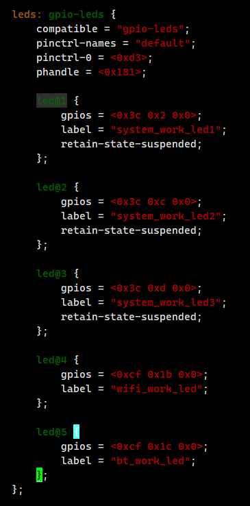
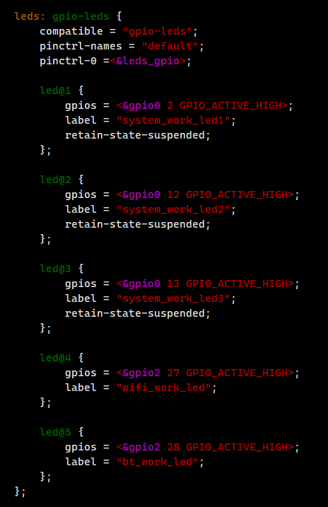
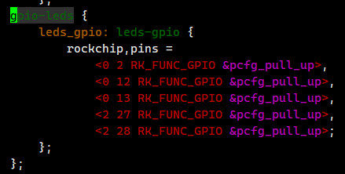
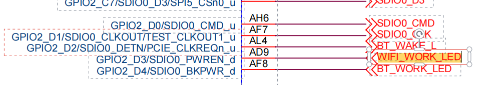
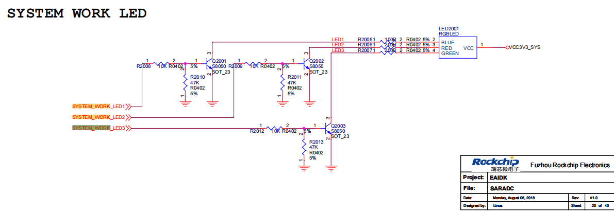
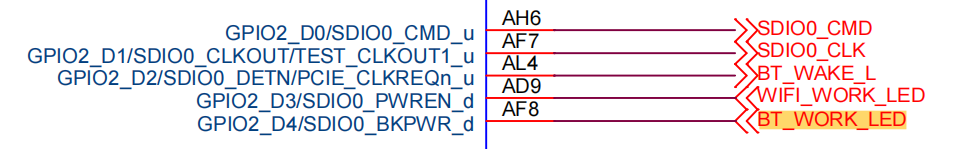
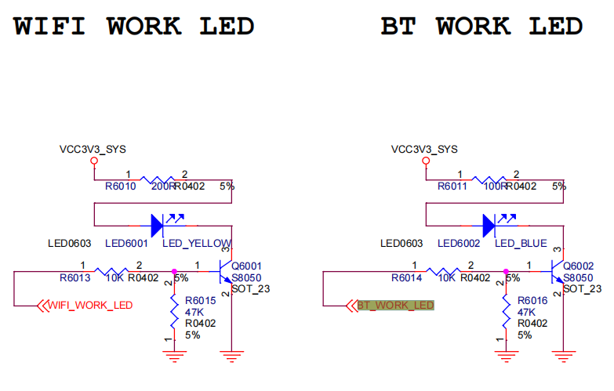

# 点亮LED灯

## dtb描述信息










## led灯组成








## 初始化

```
#if defined(CONFIG_STATUS_LED) && defined(STATUS_LED_BOOT)
static int initr_status_led(void)
{
	debug("[YYF] %s:%s:%d\n", __FILE__, __func__, __LINE__);
	status_led_set(STATUS_LED_BOOT, STATUS_LED_BLINKING);

	return 0;
}
#endif
```


```
static void status_led_init (void)
{
	led_dev_t *ld;
	int i;

	debug("[YYF] %s:%s:%d\n", __FILE__, __func__, __LINE__);
	for (i = 0, ld = led_dev; i < MAX_LED_DEV; i++, ld++)
		__led_init (ld->mask, ld->state);
	status_led_init_done = 1;
}
```


---
