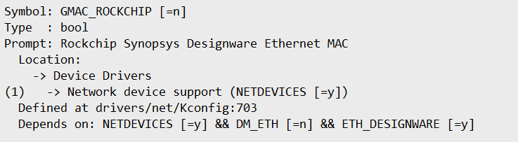
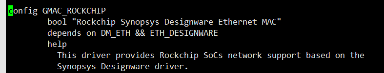

# uboot适配


## uboot编译

```
export CCACHE_BASEDIR=/root/armbian/cache/sources/u-boot/v2022.07
export PATH=/root/armbian/cache/toolchain/gcc-arm-9.2-2019.12-x86_64-aarch64-none-linux-gnu/bin::/usr/lib/ccache:/usr/local/sbin:/usr/local/bin:/usr/sbin:/usr/bin:/sbin:/bin
make distclean
echo " # yifengyou: distclean ok"

echo ""
# make menuconfig CROSS_COMPILE="aarch64-linux-gnu-"

make -j24 eaidk-610-rk3399_defconfig CROSS_COMPILE="ccache aarch64-linux-gnu-"
echo "ret=[$?]"
echo " # yifengyou: make eaidk-610-rk3399_defconfig ok"
echo ""

TIMESTAMP=`date +"%Y%m%d%H%M%S"`
sed -i "s#CONFIG_LOCALVERSION=\"\"#CONFIG_LOCALVERSION=\"-armbian_yyf_${TIMESTAMP}\"#g" .config
sed -i 's/CONFIG_LOCALVERSION_AUTO=.*/# CONFIG_LOCALVERSION_AUTO is not set/g' .config
sed -i "s/^CONFIG_BOOTDELAY=.*/CONFIG_BOOTDELAY=30/" .config

make u-boot-dtb.bin -j24 CROSS_COMPILE="ccache aarch64-none-linux-gnu-"
echo "ret=[$?]"
echo " # yifengyou: make u-boot-dtb.bin ok"
echo ""

# yifengyou: rockchip64_common.inc [/root/armbian/cache/sources/u-boot/v2022.07]
tools/mkimage -n rk3399 -T rksd -d /root/armbian/cache/sources/rkbin-tools/rk33/rk3399_ddr_933MHz_v1.25.bin idbloader.bin
#Image Type:   Rockchip RK33 (SD/MMC) boot image
#Init Data Size: 131072 bytes

# yifengyou: rockchip64_common.inc [/root/armbian/cache/sources/u-boot/v2022.07]
cat /root/armbian/cache/sources/rkbin-tools/rk33/rk3399_miniloader_v1.26.bin >> idbloader.bin

# yifengyou: rockchip64_common.inc [/root/armbian/cache/sources/u-boot/v2022.07]
/root/armbian/cache/sources/rkbin-tools/tools/loaderimage --pack --uboot ./u-boot-dtb.bin uboot.img 0x200000

#load addr is 0x200000!
#pack input ./u-boot-dtb.bin
#pack file size: 625912
#crc = 0x5c52ec76
#pack uboot.img success!

# yifengyou: rockchip64_common.inc [/root/armbian/cache/sources/u-boot/v2022.07]
/root/armbian/cache/sources/rkbin-tools/tools/trust_merger --replace bl31.elf /root/armbian/cache/sources/rkbin-tools/rk33/rk3399_bl31_v1.35.elf trust.ini
#out:trust.bin
#merge success(trust.bin)

echo "now `date`"
ls -alh uboot.img idbloader.bin trust.bin
md5sum uboot.img idbloader.bin trust.bin


echo "All done!"
```


## 烧写uboot

```
# dd if=/dev/mmcblk2 of=idbloader.bin bs=1 skip=64*512 count=217372 conv=notrunc status=none
# dd if=/dev/mmcblk2 of=trust.bin bs=1 skip=24576*512 count=4194304 conv=notrunc status=none
# dd if=/dev/mmcblk2 of=uboot.img bs=1 skip=16384*512 count=4194304 conv=notrunc status=none

dd if=idbloader.bin of=/dev/mmcblk2 seek=64 conv=notrunc status=none > /dev/null 2>&1
dd if=uboot.img of=/dev/mmcblk2 seek=16384 conv=notrunc status=none > /dev/null 2>&1
dd if=trust.bin of=/dev/mmcblk2 seek=24576 conv=notrunc status=none > /dev/null 2>&1
```


## uboot支持网络

```
"rockchip,rk3399-gmac": found on RK3399 SoCs
```



根据drivers/net/Kconfig描述，需同时打开这几个开关

```
CONFIG_GMAC_ROCKCHIP=y
CONFIG_NETDEVICES=y
CONFIG_DM_ETH=y
CONFIG_ETH_DESIGNWARE=y
```



顺便添加delay


```

CONFIG_NETDEVICES=y
CONFIG_DM_ETH=y
CONFIG_BOOTDELAY=30

```


## gpt分区下uboot启动引导问题


使用parameter.txt能够编辑分区

```
FIRMWARE_VER: 9.3.3
MACHINE_MODEL: RK3399
MACHINE_ID: 007
MANUFACTURER: RK3399
MAGIC: 0x5041524B
ATAG: 0x00200800
MACHINE: 3399
CHECK_MASK: 0x80
PWR_HLD: 0,0,A,0,1
TYPE: GPT
CMDLINE: mtdparts=rk29xxnand:0x00001000@0x00000040(idbloader),0x00002000@0x00004000(uboot),0x00002000@0x00006000(trust),-@0x00008000(rootfs)
```

但是armbian默认uboot无法引导，这时候需要进入uboot看下参数。首先uboot是支持gpt分区，并且能够正常显示所在rootfs分区

armbian默认将所有内容都放在一个rootfs分区

跟踪一下调用路径：

```
bootcmd=run distro_bootcmd
->distro_bootcmd=for target in ${boot_targets}; do run bootcmd_${target}; done
   -> 对于mmc，bootcmd_mmc0=devnum=0; run mmc_boot
      -> mmc_boot=if mmc dev ${devnum}; then devtype=mmc; run scan_dev_for_boot_part; fi
         -> mmc dev 0 返回ok, devtype=mmc; run scan_dev_for_boot_part
            -> scan_dev_for_boot_part=part list ${devtype} ${devnum} -bootable devplist; env exists devplist || setenv devplist 1; for distro_bootpart in ${devplist}; do if fstype ${devtype} ${devnum}:${distro_bootpart} bootfstype; then run scan_dev_for_boot; fi; done; setenv devplist
```


```
scan_dev_for_boot_part=
part list ${devtype} ${devnum} -bootable devplist; 
env exists devplist || setenv devplist 1; 
for distro_bootpart in ${devplist}; do 
	if fstype ${devtype} ${devnum}:${distro_bootpart} bootfstype; 	then 
		run scan_dev_for_boot;
	 fi; 
done; 
setenv devplist
```


```
scan_dev_for_boot=
echo Scanning ${devtype} ${devnum}:${distro_bootpart}...; 
for prefix in ${boot_prefixes}; do 
	run scan_dev_for_extlinux; 
	run scan_dev_for_scripts; 
done;
```

```
boot_prefixes=/ /boot/ # 遍历两个目录
boot_syslinux_conf=extlinux/extlinux.conf
scan_dev_for_extlinux= \
if test -e ${devtype} ${devnum}:${distro_bootpart} ${prefix}${boot_syslinux_conf}; then 
	echo Found ${prefix}${boot_syslinux_conf}; 
	run boot_extlinux; echo SCRIPT FAILED: continuing...; 
fi
```

```
boot_scripts=boot.scr.uimg boot.scr
scan_dev_for_scripts= \
for script in ${boot_scripts}; do
	if test -e ${devtype} ${devnum}:${distro_bootpart} ${prefix}${script}; then 
		echo Found U-Boot script ${prefix}${script}; 
		run boot_a_script; 
		echo SCRIPT FAILED: continuing...; 
	fi; 
done

```


```
scriptaddr=0x00500000
boot_a_script= \
	load ${devtype} ${devnum}:${distro_bootpart} ${scriptaddr} ${prefix}${script}; 
	source ${scriptaddr}
```


```
env set devtype mmc
env set devnum 0:4
env set load_addr 0x9000000

load mmc 0:4 0x9000000  /boot/armbianEnv.txt
env import -t 0x9000000  512

setenv bootargs 'root=/dev/mmcblk2p3 rootwait rootfstype=ext4  plymouth.ignore-serial-consoles console=ttyS2,1500000 console=tty1 consoleblank=0 loglevel=7  usb-storage.quirks=0x2537:0x1066:u,0x2537:0x1068:u    '

load mmc 0:4 0x02080000 /boot/Image
load mmc 0:4 0x06000000 /boot/uInitrd

load mmc 0:4 0x01f00000 /boot/dtb/rockchip/rk3399-eaidk-610.dtb
fdt addr 0x01f00000
fdt resize 65536

load mmc 0:4 0x9000000 /boot/dtb/rockchip/overlay/rockchip-fixup.scr
source    0x9000000


booti 0x02080000 0x06000000 0x01f00000

```


官方文档有描述：


结论：

armbian编译固件，默认采用MBR分区，没有使用GPT，但是也可以支持GPT，GPT本身兼容MBR哟
但是，为啥改成GPT不能引导，问题出在这里，在boot.cmd（编译生成的boot.scr才是在启动过程中发挥最用的）中明显强制使用了第一个分区。

但实际，大家都会习惯性将uboot.img trust.img放在开头


所以会造成，uboot在解析外部存储，没法定位到armbian rootfs分区的原因，你就算知道是mmc0，但是它强制使用了第一个分区，需要改成第三个。


换个角度，咱们把rootfs所在分区调整到开头不就行了，没错，测试发现，确实可以这样哟

```
FIRMWARE_VER: 9.3.3
MACHINE_MODEL: RK3399
MACHINE_ID: 007
MANUFACTURER: RK3399
MAGIC: 0x5041524B
ATAG: 0x00200800
MACHINE: 3399
CHECK_MASK: 0x80
PWR_HLD: 0,0,A,0,1
TYPE: GPT
CMDLINE: mtdparts=rk29xxnand:-@0x00008000(rootfs:grow),0x00001000@0x00000040(idbloader),0x00002000@0x00004000(uboot),0x00002000@0x00006000(trust)
```


Win端的瑞芯微烧写工具隐藏了太多细节，对技术人员来说并不友好，文档也不完善，得多踩坑才是。


## rk3399_loader_v1.26.bin是如何生成的？

为何每次生成都会依赖这个程序？rk3399_loader_v1.26.bin


RK3399使用两机Loader模式载入u-boot，第一段载入ddr配置文件，第二段载入uboot文件和ARM可信固件（arm-trusted-firmware）对应的编译后文件分别为rk3399_loader_v1.17.115.bin、uboot.img、trust.img。

  
https://github.com/rockchip-linux/rkbin

官方的文档真的少的一批，说了一堆规则，也不说一下怎么用


还得网上找找


https://blog.csdn.net/kris_fei/article/details/78720957


解决方案：

```
git clone https://github.com/rockchip-linux/rkbin
cd rkbin
./tools/boot_merger RKBOOT/RK3399MINIALL.ini
ls -alh *.bin
```


## 如何修改armbian第一次登陆行为

*  修改模板
*  chroot 进入到rootfs
*  /usr/lib/armbian/armbian-firstlogin


## 编译错误 previous declaration of ‘fdt64_t’ with type ‘fdt64_t’ 


```
/data/eaidk-official-src/u-boot/include/libfdt_env.h:19:16: note: previous declaration of ‘fdt64_t’ with type ‘fdt64_t’ {aka ‘long long unsigned int’}
   19 | typedef __be64 fdt64_t;
      |                ^~~~~~~
/usr/include/libfdt_env.h:51:23: error: expected ‘)’ before ‘x’
   51 | static inline fdt32_t cpu_to_fdt32(uint32_t x)
      |                       ^~~~~~~~~~~~
/data/eaidk-official-src/u-boot/include/compiler.h:66:16: error: expected ‘)’ before ‘&’ token
   66 |         ((((x) & 0xff000000) >> 24) | \
      |                ^

```


